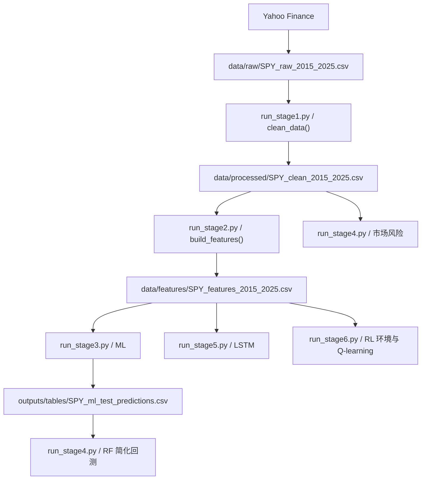

# 代码导读

> 阅读目标：知道每个文件做什么、输入输出是什么、关键代码如何对应算法。

## 1. 项目运行总入口

| 入口 | 阶段 | 主要调用 | 核心输出 |
|---|---|---|---|
| `run_stage1.py` | 数据获取与清洗 | loader、cleaner、quality、plot | 原始数据、清洗数据、质量报告、三张图 |
| `run_stage2.py` | 特征工程 | `src.features` | 特征 CSV、特征摘要 |
| `run_stage3.py` | ML 基线 | `src.ml_models` | LR/RF 指标、预测、重要性、模型 |
| `run_stage4.py` | 风险指标与简化回测 | `src.risk_metrics`、`src.backtest` | 风险表、方向分析、RF 回测 |
| `run_stage5.py` | LSTM | `src.lstm_model` | LSTM 指标、预测、模型、训练曲线 |
| `run_stage6.py` | RL 与 Q-learning | `src.trading_env`、`src.rl_agent` | 三策略指标、历史、训练日志、权益图 |

推荐运行顺序：

```powershell
python run_stage1.py
python run_stage2.py
python run_stage3.py
python run_stage4.py
python run_stage5.py
python run_stage6.py
```

## 2. 数据流



### 2.1 每阶段是否修改原始数据

| 阶段 | 输入 | 输出 | 是否覆盖原始数据 |
|---|---|---|---|
| Stage 1 | 网络数据或原始缓存 | `data/raw/`、`data/processed/` | 原始文件单独保留 |
| Stage 2 | 清洗数据 | `data/features/` | 不覆盖 |
| Stage 3 | 特征数据 | `outputs/` | 不覆盖 |
| Stage 4 | 清洗数据、Stage 3 预测 | `outputs/` | 不覆盖 |
| Stage 5 | 特征数据 | `outputs/` | 不覆盖 |
| Stage 6 | 特征数据 | `outputs/` | 不覆盖 |

## 3. src 文件逐个解析

### 3.1 需求中列出的模块

| 文件 | 关键函数 | 输入 | 输出 | 核心逻辑 | 报告对应 | 可能追问 |
|---|---|---|---|---|---|---|
| `src/data_loader.py` | `download_spy()`、`load_data()` | ticker、日期、本地缓存 | 原始 DataFrame、原始 CSV | 优先读取缓存，否则调用 yfinance | 2.2、3.2 | 为什么 `end=2026-01-01`？ |
| `src/features.py` | `build_features()` | 清洗 DataFrame | 15 列特征 DataFrame | 构造 9 项技术特征并删除 rolling NaN | 2.3、3.3 | 为什么会删 59 行？ |
| `src/ml_models.py` | `build_labels()`、`train_test_split_time_series()`、`train_and_evaluate()` | 特征 CSV | LR/RF 指标、预测、重要性、模型 | 下一日标签、顺序切分、训练与评价 | 2.4、3.4、4.2 | 为什么不能随机切分？ |
| `src/backtest.py` | `compute_strategy_returns()`、`compute_backtest_metrics()` | 市场收益、RF 预测 | 回测明细、指标、权益图 | 信号后移一日，计算仓位收益 | 2.5、3.6 | 为什么 `shift(1)`？ |
| `src/risk_metrics.py` | `compute_market_returns()`、`compute_risk_metrics()` | 清洗行情 | 市场收益、10 项风险指标 | 日收益、累计收益、回撤、VaR、CVaR | 2.5、4.4 | VaR 和 CVaR 区别？ |
| `src/trading_env.py` | `StockTradingEnv.step()`、`compute_metrics()` | 特征 DataFrame、动作 | observation、reward、history | 当前状态决策，下一期收益结算，变仓扣成本 | 3.7、4.5 | RL 如何避免未来函数？ |
| `src/utils.py` | `ensure_dirs()`、`setup_logging()`、`timer()` | 路径、函数 | 目录、日志、耗时信息 | 统一项目路径和基础工具 | 工程结构 | 为什么集中管理路径？ |

### 3.2 实际存在的补充模块

这些文件也参与项目，不能省略：

| 文件 | 关键函数或类 | 作用 |
|---|---|---|
| `src/data_cleaner.py` | `clean_data()` | 缺失、重复、负价格、排序、类型标准化 |
| `src/data_quality.py` | `generate_quality_report()` | 数据质量报告与日收益描述统计 |
| `src/plot_data_overview.py` | `generate_all_plots()` | Stage 1 三张基础图 |
| `src/lstm_model.py` | `LSTMModel`、`load_and_prepare()`、`train_model()` | LSTM 数据准备、训练、评价、保存 |
| `src/rl_agent.py` | `discretize()`、`train_qlearning()`、`evaluate_qlearning()` | 状态离散化与 Q-learning |
| `src/__init__.py` | 无 | 标记 `src` 包 |

## 4. Notebook 对应关系

| Notebook | 实际 cells | 用途 |
|---|---:|---|
| `notebooks/01_data_explore.ipynb` | 8 | 数据字段、质量、三张基础图 |
| `notebooks/02_feature_engineering.ipynb` | 6 | 特征说明、特征表、摘要 |
| `notebooks/03_ml_prediction.ipynb` | 8 | 标签、指标、预测、重要性 |
| `notebooks/04_backtest.ipynb` | 9 | 市场风险、方向分析、回测结果、权益图 |
| `notebooks/05_lstm_prediction.ipynb` | 7 | LSTM 指标、预测、训练曲线 |
| `notebooks/06_rl_trading.ipynb` | 7 | RL 基线、Q-learning、训练日志、权益图 |

## 5. 关键代码片段

### 5.1 数据清洗

位置：`src/data_cleaner.py` 的 `clean_data()`

```python
df = df[available_cols].copy()
df = df.ffill()
df = df.bfill()
df = df.dropna()
df = df[~df.index.duplicated(keep="first")]
df = df.sort_index()
```

作用：筛选核心列，填补缺失，删除残余 NaN 和重复日期，并按时间排序。

去掉会怎样：滚动窗口、时间切分和模型可能接收到异常输入。

答辩解释：清洗是保证后续统计和建模可信的前提。当前数据本身无缺失，因此结果未受填充值影响。

风险提示：`bfill()` 若用于头部 NaN，会引用后续数据。当前实际数据无缺失；更严格实验应避免这种未来回填或单独说明。

### 5.2 日收益率计算

位置：`src/features.py` 的 `build_features()`

```python
feat["return_1d"] = close.pct_change(1) * 100
feat["return_5d"] = close.pct_change(5) * 100
```

作用：把绝对价格转成相对变化。

去掉会怎样：模型和风险评估缺少短期涨跌信息。

答辩解释：收益率便于跨日期比较，也是波动率与 RL 奖励的重要基础。

### 5.3 特征工程

位置：`src/features.py` 的 `build_features()`

```python
feat["ma_20"] = close.rolling(window=20).mean()
feat["ma_60"] = close.rolling(window=60).mean()
feat["volatility_20"] = feat["return_1d"].rolling(window=20).std()
feat["volume_ma_20"] = volume.rolling(window=20).mean()
feat["close_ma20_ratio"] = close / feat["ma_20"]
feat = feat.dropna()
```

作用：构造趋势、风险、活跃度和相对位置。

去掉会怎样：模型只能看到原始行情，无法直接利用这些窗口统计信息。

答辩解释：滚动窗口初期历史不足，所以删除 NaN 行，最终从 2766 行得到 2707 行。

### 5.4 监督学习标签

位置：`src/ml_models.py` 的 `build_labels()`

```python
df["target_return_1d"] = df["return_1d"].shift(-1)
df["target_direction"] = (df["target_return_1d"] > 0).astype(int)
df = df.dropna(subset=["target_return_1d", "target_direction"])
```

作用：让日期 `t` 的特征对应日期 `t+1` 的涨跌。

去掉会怎样：模型不知道学习目标。

答辩解释：`shift(-1)` 是把下一交易日收益放到当前行作为监督标签；末行没有未来收益，需要删除。

### 5.5 时间顺序划分

位置：`src/ml_models.py` 的 `train_test_split_time_series()`

```python
split_idx = int(len(df) * (1 - test_size))
train = df.iloc[:split_idx]
test = df.iloc[split_idx:]
```

作用：使用过去训练，使用较新的数据测试。

去掉会怎样：随机切分可能把未来样本混入训练，削弱评估可信度。

答辩解释：金融序列不能像普通独立样本那样随意打乱。

### 5.6 逻辑回归与随机森林训练

位置：`src/ml_models.py` 的 `train_and_evaluate()`

```python
models = {
    "LogisticRegression": LogisticRegression(
        max_iter=5000, random_state=RANDOM_STATE,
    ),
    "RandomForestClassifier": RandomForestClassifier(
        n_estimators=100, max_depth=10, random_state=RANDOM_STATE, n_jobs=-1,
    ),
}
```

作用：形成线性基线与非线性集成模型对照。

去掉会怎样：缺少 ML 层对比。

答辩解释：复杂模型不必然更好，当前 RF 泛化弱于 LR 的表面准确率。

### 5.7 风险指标

位置：`src/risk_metrics.py` 的 `compute_risk_metrics()`

```python
annual_return = returns.mean() * TRADING_DAYS
annual_volatility = returns.std() * np.sqrt(TRADING_DAYS)
sharpe_ratio = annual_return / annual_volatility
var_95 = np.percentile(returns, 5)
cvar_95 = returns[returns <= var_95].mean()
```

作用：从收益序列计算年化收益、波动、Sharpe 和尾部风险。

去掉会怎样：只能看收益，无法讨论风险。

答辩解释：收益率不能独立阅读，必须结合波动、回撤和尾部损失。

### 5.8 回测信号后移

位置：`src/backtest.py` 的 `compute_strategy_returns()`

```python
signal = pred[MODEL_COL].astype(float)
position = signal.shift(1)
strategy_ret = position * market_ret
```

作用：使用前一日已经产生的信号计算下一日收益。

去掉会怎样：同日预测信号可能与同日收益错误对齐，产生未来函数风险。

答辩解释：预测信号必须先产生，再用于下一交易日仓位。

### 5.9 LSTM 标签 NaN 修复

位置：`src/lstm_model.py` 的 `load_and_prepare()`

```python
df["target_return_1d"] = df["return_1d"].shift(-1)
df = df.dropna(subset=["target_return_1d"])
df["target_direction"] = (df["target_return_1d"] > 0).astype(int)
```

作用：避免末行 NaN 被误标为下跌。

去掉会怎样：最后一行标签可能错误。

答辩解释：先删除未知未来收益，再构造方向标签，是时间序列标签处理的细节。

### 5.10 LSTM 序列构造

位置：`src/lstm_model.py` 的 `_create_sequences()`

```python
for i in range(len(features) - lookback):
    X.append(features[i : i + lookback])
    y.append(labels[i + lookback])
```

作用：把二维日频特征转换为三维序列样本。

去掉会怎样：LSTM 无法接收连续 20 日上下文。

答辩解释：每个输入样本是 20 天 x 9 特征，输出是窗口之后位置的涨跌标签。

### 5.11 RL 下一期奖励

位置：`src/trading_env.py` 的 `step()`

```python
next_idx = self.current_step + 1
market_ret = self.returns[next_idx] / 100.0
reward = self.position * market_ret - cost
self.equity *= (1.0 + reward)
```

作用：当前状态做动作，下一期收益结算，并扣变仓成本。

去掉会怎样：RL 环境失去清晰的时间对齐或权益变化。

答辩解释：动作不能提前拿到未来收益，只能在动作后用下一期结果评价。

### 5.12 Q-learning 状态离散化

位置：`src/rl_agent.py` 的 `discretize()`

```python
ret_1d = obs[0]
close_ma20 = obs[8]
vol_20 = obs[6]
return (r_idx, c_idx, v_idx)
```

作用：把连续状态压缩为 `3 x 3 x 3 = 27` 个状态。

去掉会怎样：表格型 Q-learning 面对大量浮点状态，难以重复学习。

答辩解释：离散化让相似行情状态共享经验，但也损失了细粒度信息。

### 5.13 Q-learning 更新

位置：`src/rl_agent.py` 的 `train_qlearning()`

```python
best_next = 0.0 if done else np.max(Q[next_state])
Q[state][action] += ALPHA * (
    reward + GAMMA * best_next - Q[state][action]
)
```

作用：将即时奖励与未来价值反馈到当前状态动作对。

去掉会怎样：Q 表不会学习。

答辩解释：新估计由旧 Q 值、即时奖励和下一状态最佳价值共同决定。

## 6. 产物目录解析

### 6.1 outputs/tables

| 文件 | 来源 | 用途 |
|---|---|---|
| `SPY_data_quality_report.csv` | Stage 1 | 数据质量 |
| `SPY_feature_summary.csv` | Stage 2 | 特征摘要 |
| `SPY_ml_baseline_metrics.csv` | Stage 3 | LR/RF 指标 |
| `SPY_ml_test_predictions.csv` | Stage 3 | Stage 4 输入 |
| `SPY_ml_feature_importance.csv` | Stage 3 | 特征解释 |
| `SPY_market_returns.csv` | Stage 4 | 市场收益与回撤 |
| `SPY_risk_metrics.csv` | Stage 4 | 风险指标 |
| `SPY_prediction_direction_analysis.csv` | Stage 4 | RF 方向统计 |
| `SPY_strategy_backtest.csv` | Stage 4 | RF 回测明细 |
| `SPY_strategy_metrics.csv` | Stage 4 | RF 回测指标 |
| `SPY_lstm_metrics.csv` | Stage 5 | LSTM 指标 |
| `SPY_lstm_test_predictions.csv` | Stage 5 | LSTM 测试预测 |
| `SPY_rl_env_baseline_metrics.csv` | Stage 6 | Random 与 B&H |
| `SPY_rl_env_baseline_history.csv` | Stage 6 | 基线历史 |
| `SPY_rl_qlearning_metrics.csv` | Stage 6 | 三策略对比 |
| `SPY_rl_qlearning_history.csv` | Stage 6 | Q-learning 历史 |
| `SPY_rl_qlearning_training_log.csv` | Stage 6 | 50 轮训练日志 |

### 6.2 outputs/figures

当前目录既包含阶段脚本图片，也包含报告辅助图片：

| 文件 | 来源 |
|---|---|
| `SPY_close_price.png`、`SPY_volume.png`、`SPY_return_distribution.png` | Stage 1 |
| `SPY_strategy_equity_curve.png` | Stage 4 |
| `SPY_lstm_training_curve.png` | Stage 5 |
| `SPY_rl_env_baseline_equity.png`、`SPY_rl_qlearning_equity.png` | Stage 6 |
| `SPY_feature_correlation_heatmap.png`、`SPY_model_prediction_comparison.png`、`SPY_strategy_drawdown_curve.png` | `../report/generate_figures.py` |

### 6.3 outputs/models

| 文件 | 来源 | 说明 |
|---|---|---|
| `SPY_logistic_regression.joblib` | Stage 3 | LR 模型 |
| `SPY_random_forest_classifier.joblib` | Stage 3 | RF 模型 |
| `SPY_lstm_model.pt` | Stage 5 | PyTorch 参数 |

Stage 6 的 Q 表没有保存为文件。当前项目中未实现 Q-table 落盘。

## 7. 代码与文档边界

### 7.1 当前未实现

- 逻辑回归和随机森林 AUC
- Stage 4 成本、滑点、税费
- 严格样本外 RL 评价
- 做空、杠杆、分数仓位
- Q 表保存
- DQN、PPO、A2C、Transformer

### 7.2 已确认的不一致

| 文件 | 不一致 |
|---|---|
| `stage4_check.md` | 是旧记录，仍写 Stage 4 不做回测；当前代码已做回测 |
| `stage6_check.md`、`FINAL_PROJECT_CHECK.md` | 写实际访问约 14 个 Q 状态；按当前代码重跑为 27 个 |
| `notebooks/06_rl_trading.ipynb` | 写 epsilon `0.30 -> 0.05`，但 50 轮日志实际结束于 `0.2335` |
| 项目根目录 | 没有 `report/`；模板适配版报告位于 `../report/` |

