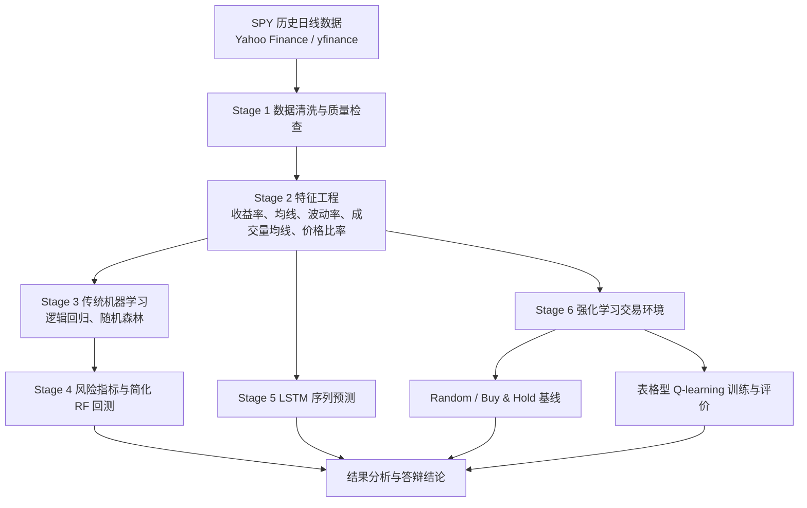

# 项目完整讲解

> 项目名称：`stock-quant-rl-course-design`  
> 题目：基于机器学习与强化学习的股票交易策略建模及量化风险评估研究  
> 定位：课程实验与方法验证，不构成实际投资建议。

## 1. 一句话概括

本项目以 SPY 日线行情为对象，完成了从数据获取、清洗、特征工程、传统机器学习、LSTM、风险评估、简化回测到表格型 Q-learning 强化学习交易实验的完整课程设计流程。

## 2. 项目目标

### 2.1 为什么研究股票涨跌方向

股票市场是典型的时间序列应用场景。每个交易日都有价格、成交量等数据，可以用来练习数据清洗、特征工程、分类模型、序列模型、风险指标与强化学习环境建模。

本项目的重点不是承诺盈利，而是回答一个课程问题：历史行情中能否提取出一些弱信号，并用不同方法客观比较其局限？

### 2.2 为什么选择 SPY

SPY 是跟踪 S&P 500 指数的 ETF。相较于单只股票，它覆盖的公司更广，成交活跃，公开历史数据较完整，受单家公司偶发事件影响相对较小。它适合作为课程实验对象，但仍然存在市场风险。

### 2.3 为什么不直接预测具体股价

价格水平受长期趋势、分红拆分、市场制度与宏观环境影响，具有非平稳性。预测“明天收盘价是多少”通常比预测“明天上涨还是不上涨”更难解释。

本项目将任务转化为二分类：

```text
下一交易日 return_1d > 0  -> label = 1，表示上涨
下一交易日 return_1d <= 0 -> label = 0，表示不上涨
```

这样可以使用 accuracy、precision、recall、F1 和 AUC 等指标，也方便把预测方向转成简化仓位。

### 2.4 为什么需要风险评估和回测

预测正确率不是收益，也不等于风险可控。一个策略即使长期收益为正，也可能经历较深回撤。回测用于在历史数据上模拟规则；风险指标用于描述收益背后的波动、回撤和尾部损失。

### 2.5 为什么加入 Q-learning

监督学习回答“明天更像上涨还是不上涨”。强化学习进一步把问题写成“观察状态后选择仓位，并根据下一期收益得到奖励”。本项目加入表格型 Q-learning，是为了展示环境、状态、动作、奖励、探索和价值更新的完整流程，而不是为了制造优于买入持有的结论。

## 3. 总体技术路线

六个脚本的实际运行顺序是 `run_stage1.py` 到 `run_stage6.py`。概念关系如下：



如果老师要求按更直观的业务过程描述，可以说：

```text
行情数据 -> 清洗 -> 特征 -> 方向预测 -> 风险指标 -> 简化回测
        -> 序列模型对比 -> 强化学习环境 -> Q-learning -> 客观总结
```

## 4. 目录结构与数据流

| 路径 | 存放内容 | 由哪个阶段产生 | 后续由谁使用 |
|---|---|---|---|
| `data/raw/` | Yahoo Finance 原始 CSV | Stage 1 | Stage 1 清洗 |
| `data/processed/` | 清洗后的 SPY 行情 | Stage 1 | Stage 2、Stage 4 |
| `data/features/` | 原始 OHLCV 加 9 项技术特征 | Stage 2 | Stage 3、Stage 5、Stage 6 |
| `notebooks/` | 6 个结果查看与讲解 notebook | 各阶段 | 学习、展示、答辩 |
| `outputs/figures/` | 数据图、训练曲线、权益曲线等 | 各阶段及报告脚本 | 报告、展示 |
| `outputs/tables/` | 指标、预测、历史记录、训练日志 | 各阶段 | 后续阶段、报告、答辩 |
| `outputs/models/` | LR、RF、LSTM 模型文件 | Stage 3、Stage 5 | 保存实验产物 |
| `src/` | 核心模块 | 各阶段 | 由入口脚本调用 |
| `run_stage1.py` 到 `run_stage6.py` | 六个一键运行入口 | 各阶段 | 复现实验 |
| `docs/` | 本次新增的学习与答辩资料 | 本次文档任务 | 复习、答辩 |

### 4.1 报告文件位置

需求中提到的模板适配版报告确实存在，但不在项目根目录内部，而在工作区同级目录：

```text
../report/大数据课设报告-模板适配版.docx
```

项目根目录下的 `report/大数据课设报告-模板适配版.docx` **不存在**。本次已经读取并核对工作区同级目录中的实际报告。

### 4.2 真实产物概览

当前关键数据文件均存在：

| 文件 | 实际规模 |
|---|---|
| `data/raw/SPY_raw_2015_2025.csv` | 2766 行 x 6 列 |
| `data/processed/SPY_clean_2015_2025.csv` | 2766 行 x 6 列 |
| `data/features/SPY_features_2015_2025.csv` | 2707 行 x 15 列 |

当前 `outputs/figures/`、`outputs/tables/`、`outputs/models/` 均存在。目录中还有少量旧命名文件，如 `spy_raw.csv`、`01_close_price.png`，属于历史遗留产物，不是当前阶段脚本的标准输出。

## 5. Stage 1：数据获取与清洗

### 5.1 做了什么

入口是 `run_stage1.py`。它依次执行：

1. 调用 `src/data_loader.py` 获取或读取 SPY 数据。
2. 调用 `src/data_cleaner.py` 清洗数据。
3. 调用 `src/data_quality.py` 生成质量报告。
4. 调用 `src/plot_data_overview.py` 生成三张基础图。

### 5.2 yfinance 的作用

`yfinance` 是一个 Python 数据接口。项目通过 `yf.download()` 下载 Yahoo Finance 提供的 SPY 历史日线行情。

代码设置：

```text
start = 2015-01-01
end   = 2026-01-01
```

`end` 是开区间，因此实际覆盖 `2015-01-02` 到 `2025-12-31`，共 `2766` 个交易日。

### 5.3 OHLCV 字段

| 字段 | 含义 | 本项目用途 |
|---|---|---|
| `Date` | 交易日期，保存为索引 | 排序、时间切分、对齐 |
| `Open` | 开盘价 | 保留为模型输入 |
| `High` | 最高价 | 保留为模型输入 |
| `Low` | 最低价 | 保留为模型输入 |
| `Close` | 收盘价 | 收益率、均线、回测的主要价格字段 |
| `Adj Close` | 复权收盘价 | 保留为模型输入和辅助说明 |
| `Volume` | 成交量 | 成交活跃度、成交量均线 |

注意：本项目实际使用 `Close` 计算收益率，并没有改用 `Adj Close`。答辩时不要混淆。

### 5.4 为什么要排序、去重、处理缺失值

- 排序：滚动窗口和时间切分必须建立在先后顺序正确的数据上。
- 去重：重复日期会让同一天被计算多次，扭曲收益和训练样本。
- 缺失值处理：模型和滚动计算通常不能直接接收 NaN。
- 异常值检查：负价格通常不符合行情常识，需要排查或删除。

当前实际数据在清洗前后都是 `2766` 行，缺失值为 `0`，重复日期为 `0`。因此清洗逻辑提供了保护，但没有在当前样本中删除数据。

### 5.5 为什么计算 return_1d

日收益率公式：

```text
return_1d(t) = (Close(t) / Close(t-1) - 1) * 100%
```

Stage 1 的质量报告使用它描述每日涨跌分布。Stage 2 会正式把它放入特征集。

### 5.6 输出与衔接

| 输出 | 作用 |
|---|---|
| `data/raw/SPY_raw_2015_2025.csv` | 原始缓存 |
| `data/processed/SPY_clean_2015_2025.csv` | Stage 2 和 Stage 4 输入 |
| `outputs/tables/SPY_data_quality_report.csv` | 数据质量证据 |
| `outputs/figures/SPY_close_price.png` | 收盘价与均线 |
| `outputs/figures/SPY_volume.png` | 成交量 |
| `outputs/figures/SPY_return_distribution.png` | 日收益分布 |

### 5.7 对应代码

- `src/data_loader.py`：`download_spy()`、`load_data()`
- `src/data_cleaner.py`：`clean_data()`
- `src/data_quality.py`：`generate_quality_report()`
- `src/plot_data_overview.py`：`generate_all_plots()`

## 6. Stage 2：特征工程

### 6.1 什么是特征工程

特征工程是把原始数据加工成模型更容易使用的变量。原始价格本身包含信息，但它受长期趋势和绝对尺度影响。课程实验中通常还需要构造收益率、趋势、波动和相对位置等变量。

### 6.2 九项技术特征

| 特征 | 定义 | 直观含义 |
|---|---|---|
| `return_1d` | 1 日收盘收益率 | 最近一天涨跌幅 |
| `return_5d` | 5 日收盘收益率 | 最近一周左右累计变化 |
| `ma_5` | 5 日收盘价均值 | 短期趋势 |
| `ma_10` | 10 日收盘价均值 | 较短趋势 |
| `ma_20` | 20 日收盘价均值 | 月度附近趋势 |
| `ma_60` | 60 日收盘价均值 | 中期趋势 |
| `volatility_20` | `return_1d` 的 20 日滚动标准差 | 近期波动风险 |
| `volume_ma_20` | 成交量的 20 日均值 | 近期活跃度 |
| `close_ma20_ratio` | `Close / ma_20` | 价格相对 20 日均线的位置 |

移动均线能平滑短期噪声，波动率能刻画涨跌幅离散程度，`close_ma20_ratio > 1` 通常表示价格位于 20 日均线上方。

### 6.3 为什么滚动窗口会产生 NaN

计算 60 日均线需要当前日及之前 59 日。最初没有足够历史数据，因此前 59 行会出现 NaN。项目调用 `dropna()` 删除这些不完整样本：

```text
2766 行清洗数据 -> 2707 行完整特征数据
```

### 6.4 相关性热力图怎么看

`outputs/figures/SPY_feature_correlation_heatmap.png` 已存在。颜色越接近极端，说明两个变量的线性相关程度越强。OHLC 和多条均线通常高度相关，这是因为它们都来自价格水平。

需要注意：`run_stage2.py` 和 `src/features.py` **没有生成热力图**。该图由工作区同级目录的 `../report/generate_figures.py` 生成，属于报告辅助图，不是 Stage 2 核心脚本输出。

### 6.5 对应代码

- `src/features.py`：`build_features()`、`save_features()`、`generate_feature_summary()`
- `run_stage2.py`：串联输入、构造和保存

## 7. Stage 3：传统机器学习预测

### 7.1 为什么是二分类

标签只有两类：

```text
1 = 下一交易日上涨
0 = 下一交易日不上涨
```

代码先计算：

```python
target_return_1d = return_1d.shift(-1)
```

这表示当前行的特征对应下一交易日收益。末行没有未来一天，因此删除。

### 7.2 为什么不能随机打乱

金融数据有时间顺序。随机打乱后，训练集可能包含比测试集更晚的数据，形成不符合真实应用过程的信息泄漏。项目按顺序切分：

```text
2706 个有效样本
前 80%：2164 个训练样本
后 20%：542 个测试样本
```

### 7.3 两个模型

| 模型 | 原理简述 | 作用 |
|---|---|---|
| 逻辑回归 | 对特征线性组合后通过 sigmoid 输出上涨概率 | 简单、可解释的基线 |
| 随机森林 | 多棵决策树对结果集成投票 | 对非线性关系提供对照 |

### 7.4 指标结果与谨慎解释

| 模型 | accuracy | precision | recall | F1 |
|---|---:|---:|---:|---:|
| Logistic Regression | 0.5886 | 0.5886 | 1.0000 | 0.7410 |
| Random Forest | 0.4188 | 0.6429 | 0.0282 | 0.0541 |

测试集中实际上涨日为 `319 / 542 = 58.86%`。

- 逻辑回归把 `542 / 542` 个样本全部预测为上涨。它的 accuracy 恰好等于上涨类别占比，不能直接理解为学到了稳定交易规律。
- 随机森林把 `528 / 542` 个样本预测为不上涨，只预测了 `14` 个上涨日。其上涨召回率只有 `2.82%`，说明泛化表现不足。

这正是答辩时应强调的结论：accuracy 必须结合类别分布、precision、recall 和 F1 阅读。

### 7.5 对应代码

- `src/ml_models.py`：`build_labels()`、`train_test_split_time_series()`、`train_and_evaluate()`
- `run_stage3.py`：训练、指标、预测、特征重要性保存

## 8. Stage 4：风险指标与简化回测

### 8.1 什么是回测

回测是在历史数据上按照固定规则模拟策略表现。它只能说明历史样本中的结果，不能保证未来收益。

### 8.2 买入持有与策略收益

- 买入持有：一开始持有标的，此后不主动择时。
- 简化 RF 策略：随机森林预测上涨时持有 SPY，预测不上涨时空仓。

策略日收益：

```text
strategy_return(t) = position(t) * market_return(t)
```

### 8.3 为什么信号要 shift(1)

Stage 3 中，日期 `t` 的特征用于预测 `t+1` 的方向。回测计算 `t+1` 收益时，应使用 `t` 已经生成的信号，而不能使用 `t+1` 当天才知道的信号：

```python
position = signal.shift(1)
strategy_ret = position * market_ret
```

这用于降低未来函数风险。

### 8.4 市场风险指标

| 指标 | 当前结果 | 含义 |
|---|---:|---|
| 年化收益率 | 12.5362% | 按日均收益乘 252 估计 |
| 年化波动率 | 17.8595% | 日收益标准差乘 `sqrt(252)` |
| Sharpe ratio | 0.7019 | 每单位波动对应的年化收益，未扣无风险利率 |
| 最大回撤 | -34.1047% | 历史高点到后续低点的最大跌幅 |
| Calmar ratio | 0.3676 | 年化收益除以最大回撤绝对值 |
| VaR 95% | -1.6773% | 最差约 5% 交易日的分界值 |
| CVaR 95% | -2.7319% | 落入最差 5% 后的平均损失 |

SPY 最大回撤 `-34.10%` 表示：即使研究期长期上涨，持有过程中也曾出现从阶段高点回落约三分之一的历史区间。收益不能脱离风险单独讨论。

### 8.5 Stage 4 RF 简化回测

| 指标 | 当前结果 |
|---|---:|
| total return | +6.0173% |
| annual return | +2.7480% |
| annual volatility | 2.2936% |
| Sharpe ratio | 1.1981 |
| max drawdown | -0.8745% |
| `win_rate` | 1.66% |
| number of trades | 13 |

这里必须谨慎：

- Stage 4 没有扣交易成本、滑点或税费。
- `win_rate` 的代码是 `(strategy_return_1d > 0).mean()`，分母是全部回测日，不是逐笔交易次数。
- 由于 RF 只预测 `14` 个上涨日，策略大多数时间空仓。`541` 个回测日中有 `527` 天策略收益为 `0`。
- 因此 Stage 4 的收益和 Sharpe 只适合展示回测流程，不能过度解释。

### 8.6 对应代码

- `src/risk_metrics.py`：`compute_market_returns()`、`compute_risk_metrics()`
- `src/backtest.py`：`compute_strategy_returns()`、`compute_backtest_metrics()`
- `run_stage4.py`：风险与回测入口

## 9. Stage 5：LSTM 方向预测

### 9.1 什么是时间序列与 LSTM

时间序列是按时间顺序排列的数据。LSTM 是一种带门控机制的循环神经网络，可以在序列中保留或遗忘信息。它比普通 RNN 更适合处理较长依赖，但并不保证在高噪声金融数据上获得更好结果。

### 9.2 20 日窗口如何构造

LSTM 只使用 9 项技术特征。每个样本包含连续 20 个交易日：

```text
X[i] = 第 i 天到第 i+19 天的 9 项技术特征
y[i] = 第 i+20 天对应的涨跌标签
```

因此形状为：

```text
训练 X：约 (2144, 20, 9)
测试 X：约 (522, 20, 9)
训练 y：约 (2144,)
测试 y：约 (522,)
```

### 9.3 门控机制

| 组件 | 作用 |
|---|---|
| 遗忘门 | 决定旧信息保留多少 |
| 输入门 | 决定新信息写入多少 |
| 输出门 | 决定当前状态输出多少 |
| 细胞状态 | 跨时间传递的长期记忆通道 |

### 9.4 标签 NaN 修复

当前代码已经正确实现：

```python
df["target_return_1d"] = df["return_1d"].shift(-1)
df = df.dropna(subset=["target_return_1d"])
df["target_direction"] = (df["target_return_1d"] > 0).astype(int)
```

必须先删除末行的未来收益 NaN，再构造方向。否则 `NaN > 0` 会得到 `False`，末行可能被错误标成下跌。

### 9.5 当前结果

| 指标 | 值 |
|---|---:|
| accuracy | 0.4540 |
| precision | 0.6173 |
| recall | 0.1645 |
| F1 | 0.2597 |
| AUC | 0.4916 |
| test samples | 522 |

AUC 接近 `0.5`，表示当前模型区分上涨与不上涨的能力接近随机排序水平。LSTM 效果不好不代表课程项目失败，因为本项目成功验证了序列构造、训练、评估和标签修复流程，也客观展示了金融短期预测的难度。

### 9.6 对应代码

- `src/lstm_model.py`：`LSTMModel`、`_create_sequences()`、`load_and_prepare()`、`train_model()`、`evaluate_model()`
- `run_stage5.py`：一键入口

## 10. Stage 6：强化学习与 Q-learning

### 10.1 六个基本概念

| 概念 | 本项目中的含义 |
|---|---|
| agent | Q-learning 智能体 |
| environment | `StockTradingEnv` |
| state | 从当前技术特征提取并离散化后的状态 |
| action | `0=空仓`，`1=持有 SPY` |
| reward | 下一期持仓收益减仓位变化成本 |
| policy | 根据 Q 表选择动作的规则 |

### 10.2 环境如何避免未来函数

环境在步骤 `i` 观察当前特征，动作在下一期收益上生效：

```python
next_idx = self.current_step + 1
market_ret = self.returns[next_idx] / 100.0
reward = self.position * market_ret - cost
```

如果仓位发生变化，扣除 `0.001 = 0.1%` 成本。

### 10.3 为什么只有空仓与持有

这是课程级简化。两类动作已经足够展示状态、动作、奖励、成本和价值更新。项目没有实现做空、杠杆、分数仓位、滑点、税费和流动性约束。

### 10.4 状态离散化

环境原始观察包含 9 个技术特征，但 Q-learning 从中选取 3 个变量：

| 特征 | 三个区间 |
|---|---|
| `return_1d` | `< -0.5`、`[-0.5, 0.5]`、`> 0.5` |
| `close_ma20_ratio` | `< 0.98`、`[0.98, 1.02]`、`> 1.02` |
| `volatility_20` | `< 0.8`、`[0.8, 1.5]`、`> 1.5` |

理论状态数：

```text
3 x 3 x 3 = 27
```

本次按当前代码重新训练核验，27 个状态均被访问。

### 10.5 epsilon-greedy

训练时：

- 以 `epsilon` 概率随机探索；
- 以 `1 - epsilon` 概率选择当前 Q 值最大的动作。

配置为 `epsilon=0.30` 开始，最小值为 `0.05`，每轮乘 `0.995`。训练只有 50 轮，因此当前日志中的最终 epsilon 是 `0.2335`，并没有降到 `0.05`。

### 10.6 Q-learning 更新公式

```text
Q(s,a) <- Q(s,a) + alpha * [r + gamma * max Q(s',a') - Q(s,a)]
```

- `Q(s,a)`：当前认为在状态 `s` 选择动作 `a` 的长期价值。
- `r`：当前动作得到的即时奖励。
- `max Q(s',a')`：到达下一状态后可得到的最佳未来价值。
- `alpha=0.1`：学习率。
- `gamma=0.95`：未来奖励折扣因子。

### 10.7 三策略结果

| 策略 | total return | annual return | Sharpe | max drawdown | trades |
|---|---:|---:|---:|---:|---:|
| Random | -57.6447% | -7.1282% | -0.5415 | -64.0596% | 1355 |
| Buy & Hold | +227.1229% | +12.6522% | 0.7055 | -34.1047% | 0 |
| Q-learning | +6.5649% | +0.9670% | 0.1119 | -18.0356% | 711 |

Q-learning 没有超过买入持有。原因包括：

- 研究期内 SPY 长期总体上涨，买入持有天然受益。
- Q-learning 只使用 3 个离散化特征。
- 动作只有空仓和持有。
- 训练只有 50 轮。
- 频繁变仓会扣成本。
- RL 训练和评估使用同一段完整历史数据，当前结果不是严格样本外评价。

未超过买入持有不等于课程实验失败。项目完成了强化学习建模和基线比较，并据实呈现了局限。

### 10.8 对应代码

- `src/trading_env.py`：`StockTradingEnv`、`run_random_baseline()`、`run_buy_and_hold()`、`compute_metrics()`
- `src/rl_agent.py`：`discretize()`、`train_qlearning()`、`evaluate_qlearning()`
- `run_stage6.py`：基线、训练、评价和绘图入口

## 11. 实验结果总解释

| 结果 | 应该怎么解释 |
|---|---|
| LR accuracy = 0.5886 | 表面上相对最好，但它将测试样本全部预测为上涨，结果主要反映测试集上涨比例。 |
| RF accuracy = 0.4188 | 对上涨类别召回很低，说明当前设定下泛化不足。 |
| LSTM accuracy = 0.4540 | 没有表现出优于简单基线的预测能力。 |
| LSTM AUC = 0.4916 | 接近 0.5，排序区分能力接近随机。 |
| Q-learning return = +6.56% | 在简化环境中得到正收益，但不是样本外投资结论。 |
| Buy & Hold return = +227.12% | 研究期内 SPY 长期上涨，持有基线明显更强。 |
| SPY max drawdown = -34.10% | 长期收益伴随显著历史下行风险。 |

总体结论：复杂模型不必然优于简单基线。金融短期方向预测噪声高、弱信号明显。本项目的价值是完成方法链路、风险意识和客观比较，而不是构造真实投资系统。

## 12. 课程设计角度的创新点

1. 形成 ML、DL、RL 三层方法对比，而不是只训练一个模型。
2. 不只看分类准确率，还加入风险指标和回测。
3. 自己构建了强化学习交易环境，并明确动作与奖励的时间对齐。
4. 使用表格型 Q-learning 展示状态离散化、探索和价值更新。
5. 能够客观解释模型弱点，没有把正收益包装成投资建议。

## 13. 已知不足

1. 只使用 SPY 单一标的。
2. 特征主要来自历史行情，未引入宏观、基本面、新闻或情绪数据。
3. Stage 4 回测没有扣交易成本、滑点、税费和真实执行约束。
4. Stage 6 只做空仓和持有，状态表达较简单。
5. LSTM 使用单层网络与基础参数，没有大规模调参。
6. LR 未进行特征标准化，且输入中存在价格、成交量等尺度差异很大的变量。
7. RL 在同一段历史数据上训练与评价，没有严格样本外测试。
8. 结果不能作为实际投资建议。

## 14. 缺失项、不一致与潜在风险

### 14.1 缺失项

| 项目 | 结论 |
|---|---|
| 项目根目录内的 `report/大数据课设报告-模板适配版.docx` | 不存在；实际文件位于 `../report/` |
| 逻辑回归 AUC | 当前结果未输出 |
| 随机森林 AUC | 当前结果未输出 |
| DQN、PPO、A2C、Transformer | 项目中未实现，并且本次不新增 |
| 做空、杠杆、分数仓位 | 项目中未实现 |
| Stage 4 交易成本、滑点、税费 | 项目中未实现 |

### 14.2 报告、代码和历史检查记录

模板适配版报告与当前核心 CSV 结果总体一致。以下是不一致或容易误解的地方：

| 位置 | 现象 | 正确理解 |
|---|---|---|
| `stage4_check.md` | 仍描述旧版 Stage 4 “不做回测”、6 cells | 当前 Stage 4 已包含回测，`04_backtest.ipynb` 实际为 9 cells；该检查文件是历史记录 |
| `stage6_check.md`、`FINAL_PROJECT_CHECK.md` | 写 Q 表实际访问约 14 个状态 | 按当前代码重新训练，27 个状态均被访问；历史检查文本未同步 |
| `notebooks/06_rl_trading.ipynb` | 写 epsilon `0.30 -> 0.05` | `0.05` 是下限；50 轮后实际为 `0.2335` |
| Stage 6 策略表 | Buy & Hold `trades=0` | 代码统计仓位序列内部变化，不计初始建仓；但首次持有仍扣成本 |
| Stage 4 `win_rate` | 数值为 `1.66%` | 它是全部回测日中正收益日比例，不是通常的逐笔交易胜率 |

### 14.3 潜在风险

| 风险 | 当前情况 | 答辩表述 |
|---|---|---|
| 未来函数 | Stage 4 使用 `signal.shift(1)`；Stage 6 使用下一期收益作为动作奖励，主要对齐正确 | “项目显式处理了时间对齐，但仍只属于课程级简化验证。” |
| 清洗时 `bfill()` | 若开头有 NaN，会使用后续数据回填 | 当前原始数据无缺失，实际结果未受影响；更严格研究中应避免或单独说明 |
| 标签错位 | LSTM 曾有末行 NaN 风险 | 当前代码已先 `dropna` 再构造标签 |
| ML 特征尺度 | LR 未标准化，成交量与价格尺度差异大 | 可能影响优化与解释，当前只作为基线 |
| RL 数据泄漏 | RL 训练和评估使用同一整段历史 | Q-learning 结果不能视为样本外泛化能力 |
| 测试集重复观察 | LSTM 每轮记录测试损失和准确率 | 未据此调参，但严格实验应独立设置验证集与最终测试集 |
| 结果过度解释 | 正收益可能被误读为实盘能力 | 所有结论只用于课程实验，不构成投资建议 |

## 15. 三个答辩总结版本

### 15.1 10 秒版

本项目用 SPY 日线数据完成了清洗、特征工程、ML、LSTM、风险评估、回测和 Q-learning 实验，重点是展示完整方法流程，并客观说明短期金融预测难度较高。

### 15.2 30 秒版

我选择 SPY 作为相对稳定、有代表性的 ETF，用历史日线行情构造收益率、均线、波动率等特征，比较逻辑回归、随机森林和 LSTM 的下一交易日涨跌分类效果，并计算风险指标和简化回测。最后，我构建了只有空仓和持有两类动作的交易环境，用表格型 Q-learning 做课程级强化学习实验。结果显示复杂模型并不一定更好，所有结果只用于方法验证。

### 15.3 1 分钟版

本项目研究的是金融数据挖掘方法在 SPY 日线数据上的完整应用流程。首先通过 yfinance 获取 2015 年到 2025 年的行情，完成清洗和质量检查；然后构造收益率、移动均线、波动率、成交量均线和价格相对位置等特征。监督学习部分使用逻辑回归和随机森林预测下一交易日涨跌，LSTM 部分用 20 日窗口做序列分类。之后计算年化收益、波动率、Sharpe、最大回撤、VaR 和 CVaR，并进行简化回测。最后构建强化学习环境，用表格型 Q-learning 对比随机策略和买入持有。实验中 Q-learning 收益为正，但明显弱于买入持有；LSTM AUC 接近 0.5。结论是项目完成了课程级方法验证，也说明金融短期预测很难，结果不能作为实际投资建议。

